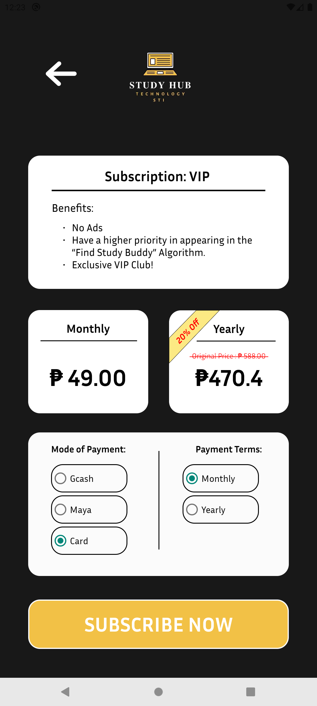

# StudyHub

<link rel="stylesheet" type="text/css" href="misc/readme-styles.css"/>

## Description

This is our final project for one of our subjects in college, namely Technopreneurship. We presented this app in front of a board of panelists inside a classroom, and out of all the groups that presented for that subject, we managed to defend our product successfully and achieve top #1 in terms of score.

The _"Study Hub"_ app addresses the challenge faced by students seeking academic goals and support while navigating the difficulty of their college journey. A lot of students are left with a gap in finding reliable study partners and tutors, and to the high achieving students that aren’t rewarded for the effort they provide to teach a fellow classmate. Not everyone can learn and produce output as fast and efficiently as others, and this has created an environment where students can easily get left behind in their studies, but sometimes all they need is a little help. Our solution bridges this gap by providing a platform that facilitates connections based on academic needs and goals.

### Developers

- [DragunWF](https://github.com/DragunWF) - **Back-End Developer, Leader**
- [JasDevPH](https://github.com/JasDevPH) - **Front-End Developer, UI/UX Designer**
- [n-ginan](https://github.com/n-ginan) - **Back-End Developer, Assistant**

### StudyHub Business Proposal PDF

- [Link to StudyHub Business Proposal](misc/StudyHub-BusinessProposal.pdf)

## Features

- User login/registration, password update, account info edit.
- Two account types, student and tutor. Both of which have different permissions on the app's features.
- _"Find Study Buddy"_ algorithm that matches you with other students based on your course, interests, and keywords on your profile's description.
- Ability to send _"Buddy Request"_ which is the app's term for a friend request.
- Profile page that displays the user's information.
- Dashboard page with the ability to filter out users via their names based on the input typed inside the search box and the account type as well as the course chosen on the dropdown menu (See [Images](#images-of-the-mobile-app) for a visualization of the dashboard page).
- Input validation on forms based pages.
- Subscriptions with various payment options (Simulation).

## Images of the Mobile App

### Landing Page

    

### Login and Registration Page

    
    

### Dashboard Page

    
    
    
    

### Profile Page

    
    

### Edit Account Information Page

    

### Find Buddy Page

    
    

### Study Buddy Request List

    

### Subscription Page

    

### Payment Pages

    
    

## SQLite3 Entity Relationship Diagram

## Disclaimer

This is for simulation purposes. Hence why we used SQLite3 instead of MySQL.
